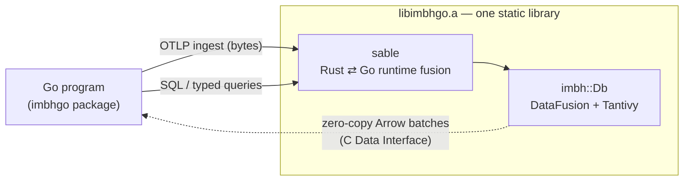

# imbh-go

A Go binding for **[IMBH](https://github.com/moriyoshi/imbh)** — an embeddable, Rust observability database (logs, traces,
metrics on Apache DataFusion) — with **zero-copy Apache Arrow** query results, fused onto Go's
scheduler via **[sable](https://github.com/moriyoshi/sable)**.

You open an IMBH database from Go, feed it OpenTelemetry (OTLP) data, and query it with SQL or typed
observability queries. Query results cross the language boundary as Arrow record batches **without a
copy**: Go holds IMBH's `Arc`-refcounted Arrow buffers by pointer and releases them when done.

```go
db, _ := imbhgo.OpenInMemory()
defer db.Close()
ctx := context.Background()

db.IngestOTLPLogs(otlpBytes)                 // what any OTLP/HTTP exporter sends

logs, _ := db.QueryLogsTyped(ctx, imbhgo.LogQuery{Service: "checkout", Match: "error"})
for _, e := range logs {
    fmt.Println(e.Time, e.Service, e.Body)
}
```

> **Status: early but working.** The full path — open → ingest → SQL, typed queries, **and the LGTM
> query languages (PromQL / LogQL / TraceQL)**, all zero-copy → errors → cancellation → backpressure —
> is implemented and tested (46 tests under `-race`, including on-disk durability, concurrency-under-load,
> and the admin / lifecycle / cursor-paging surface), and the memory-ownership protocol is leak-verified
> two independent ways (an in-process counter and a Valgrind gate). **Dependencies are now external** —
> imbh from crates.io and sable git-pinned — so it builds without local checkouts, and CI
> (`.github/workflows/ci.yml`) runs the whole gate on `linux/amd64` and `linux/arm64` for every push
> and pull request.
> See [Feature coverage](#feature-coverage) for what is and isn't exposed, and
> [Limitations](#limitations--roadmap).

---

## How it works



- Everything links into **one combined static library** (`libimbhgo.a`) containing IMBH, sable's
  runtime, and the binding's handlers.
- Queries stream **one Arrow batch per await**: the goroutine parks between batches while IMBH's
  engine runs, so no OS thread is blocked and the query executes lazily (bounded memory).
- Each result batch crosses via the **Arrow C Data Interface** (`FFI_ArrowArray`), imported by
  `arrow-go/cdata` — no serialization, no `GoBytes` copy.

The full design is in [`ARCHITECTURE.md`](./ARCHITECTURE.md).

## Requirements

- **Go 1.26.4** (pinned — sable reaches Go's internal ABI via `//go:linkname`). `go.mod` enforces
  this toolchain, so Go downloads it automatically.
- **cgo** (a C toolchain) to link the static library into your binary.
- The `github.com/apache/arrow-go/v18` module (for reading result batches).
- **Rust** (stable, 1.96+) is needed **only if you build the library from source**. Consumers using a
  prebuilt archive (below) do not need Rust.

Prebuilt `libimbhgo.a` archives are published per platform (see [Using a prebuilt library](#using-a-prebuilt-library-no-rust-build)).

## Using a prebuilt library (no Rust build)

You can depend on the binding without ever building the Rust side. `cmd/imbhgo-fetch` downloads the
prebuilt `libimbhgo.a` for your platform from the matching GitHub release, verifies its checksum, and
prints the `CGO_LDFLAGS` to link against it:

```sh
go get github.com/moriyoshi/imbh-go@v0.1.1
eval "$(go run github.com/moriyoshi/imbh-go/cmd/imbhgo-fetch@v0.1.1 -print-env)"
go build -tags sable_extern_lib ./...
```

- The `sable_extern_lib` build tag is **required** — it makes sable's Go package link the combined
  archive rather than its own `libsable.a`.
- `-print-env` emits POSIX shell syntax on **every** platform, including Windows — the shell that
  consumes the line is the one you invoked the tool from, and on Windows CI that is normally
  git-bash / MSYS2. From a native Windows shell, ask for its dialect explicitly:

  ```bat
  for /f "delims=" %i in ('go run github.com/moriyoshi/imbh-go/cmd/imbhgo-fetch@v0.1.1 -print-env -shell cmd') do @%i
  ```

  ```powershell
  go run github.com/moriyoshi/imbh-go/cmd/imbhgo-fetch@v0.1.1 -print-env -shell powershell | Invoke-Expression
  ```
- The fetch tool caches the archive under your user cache dir (override with `-dest`) and re-detects
  glibc vs musl on Linux automatically (override with `-libc`).
- Prebuilt cells: Linux `amd64`/`arm64` (glibc and musl), macOS `amd64`/`arm64`, and Windows `amd64`
  (best-effort). Each archive is pinned to the Go toolchain in `go.mod`.

## Building from source

To build the static library yourself (co-development, or a platform with no prebuilt), build the Rust
side first; the Go package links it.

```sh
make            # cargo build --release in rust/  → rust/target/release/libimbhgo.a
make test       # go test -tags sable_extern_lib -race ./...
```

Then compile your program with the `sable_extern_lib` build tag:

```sh
go build -tags sable_extern_lib ./...
```

(The per-platform cgo linker flags live in `link_linux.go` / `link_darwin.go` / `link_windows.go`;
they default to `rust/target/release` for a local build, and defer to `CGO_LDFLAGS` for a prebuilt.)

### Cutting a release (maintainers)

```sh
make release VERSION=v0.1.2   # rewrite the version everywhere, then build + vet + race-test
```

That rewrites `internal/release.Version` — which the release workflow requires the tag to match —
along with the version references in this README and in `cmd/imbhgo-fetch`, then runs the local gate.
It stops there and prints the remaining steps: commit, merge to `main`, then `git push origin
v0.1.2`. Pushing the tag is what triggers `.github/workflows/release.yml`, which cross-builds every
prebuilt cell, attaches the archives plus `SHA256SUMS` to the release, and smoke-tests the result as
a consumer would.

## Quick start

A complete runnable tour lives in [`examples/quickstart`](./examples/quickstart) — it ingests OTLP
logs and metrics and queries them three ways:

```sh
make            # build the static library
make example    # go run -tags sable_extern_lib ./examples/quickstart
```

The package initializes the runtime automatically on first use — just import and go.

```go
package main

import (
	"context"
	"fmt"

	imbhgo "github.com/moriyoshi/imbh-go"
)

func main() {
	db, err := imbhgo.OpenInMemory() // or imbhgo.Open("/path/to/data")
	if err != nil {
		panic(err)
	}
	defer db.Close()
	ctx := context.Background()

	// Ingest OTLP/HTTP export-request protobuf bytes (from any OTel SDK exporter).
	if _, err := db.IngestOTLPLogs(otlpLogBytes); err != nil {
		panic(err)
	}

	// Query with SQL — results stream as zero-copy Arrow batches.
	rows, err := db.Query(ctx, "SELECT service, count(*) AS n FROM logs GROUP BY service")
	if err != nil {
		panic(err)
	}
	defer rows.Close()
	for {
		rec, ok, err := rows.Next()
		if err != nil {
			panic(err)
		}
		if !ok {
			break
		}
		fmt.Println(rec) // an arrow.RecordBatch
		rec.Release()    // return the buffers when done
	}
}
```

## Querying

### SQL (lazy, zero-copy)

`Query` streams the result batch-by-batch through IMBH's lazy scan. Tables: `logs`, `spans`,
`metrics_gauge`, `metrics_sum`, `metrics_histogram`, and more. IMBH's UDFs are available in SQL —
including `histogram_quantile`, `matches` (full-text), and `json_get_str`:

```go
rows, _ := db.Query(ctx,
    "SELECT histogram_quantile(0.95, explicit_bounds, bucket_counts) AS p95 " +
        "FROM metrics_histogram WHERE metric = 'http.server.duration'")
```

`Query` returns `*Rows`; iterate with `Next() (arrow.RecordBatch, ok bool, err error)` until `ok` is
false, then check `Err()`. Every query takes a `context.Context` as its first argument — cancel a
running query by cancelling that `ctx`, and a parked `Next` is interrupted and reports
`context.Canceled` from `Err()`.

### Typed queries

Endpoint-shaped queries as native Go structs. Each has a raw form (returns `*Rows` of Arrow batches)
and a decoded form (returns Go structs).

```go
// Logs → []LogEntry
entries, _ := db.QueryLogsTyped(ctx, imbhgo.LogQuery{
    Service: "checkout",
    Match:   "timeout",       // full-text on the body
    Limit:   100,
})

// Metric range → a Matrix (one series per group-by label set)
m, _ := db.QueryMetricsTyped(ctx, imbhgo.MetricQuery{
    Metric:  "cpu.utilization",
    Step:    int64(time.Second),
    Start:   start.UnixNano(),
    End:     end.UnixNano(),
    GroupBy: []string{"host"},
})
for _, s := range m.Series {
    fmt.Println(s.Labels, len(s.Points))
}

// Span RED metrics → []SpanMetricPoint (calls / errors / p50 / p95 / p99)
red, _ := db.QuerySpanMetricsTyped(ctx, imbhgo.SpanMetricsQuery{
    Service: "checkout",
    Step:    int64(time.Minute),
    Start:   start.UnixNano(),
    End:     end.UnixNano(),
})
```

Typed queries collect eagerly (they materialize the result), so prefer them for bounded results
(a limited page, a fixed-step range) and use `Query(ctx, sql)` for large, unbounded scans.

### LGTM query languages (PromQL / LogQL / TraceQL)

IMBH implements the Grafana-stack query languages as explicitly-versioned compatibility profiles, and
the binding exposes them over the same zero-copy Arrow path. Constructs outside a profile are rejected
with a clear diagnostic rather than silently approximated.

```go
// PromQL → labeled series. Metric names resolve against the stored catalog
// (OTel dots map to Prometheus underscores: cpu.util → cpu_util).
series, _ := db.QueryPromQLSeries(ctx, "rate(http_requests_total[5m])", start, end, step)
for _, s := range series {
    fmt.Println(s.Labels, len(s.Points))
}

// LogQL has two result shapes, as in Loki:
lines,  _ := db.QueryLogQLLines(ctx, `{service="checkout"} |= "error"`, start, end, 100) // streams
counts, _ := db.QueryLogQLSeries(ctx, `count_over_time({service="checkout"}[5m])`, start, end, step) // matrix

// TraceQL → matching traces + the span ids its spanset selected.
// Note attribute scope: service.name is a *resource* attribute.
matches, _ := db.QueryTraceQLMatches(ctx, `{ resource.service.name = "checkout" }`, start, end)

// …and follow a match through to that trace's spans (zero-copy).
spans, _ := db.GetTraceSpans(ctx, matches[0].TraceID)
```

Each also has a raw `*Rows` form (`QueryPromQL`, `QueryLogQL`, `QueryTraceQL`, `GetTrace`). Like every
query method, all take a `context.Context` first argument for cancellation.

## Ingesting

`IngestOTLPLogs`/`IngestOTLPTraces`/`IngestOTLPMetrics` take the protobuf bytes an OTLP/HTTP exporter
sends (an `ExportLogsServiceRequest`, etc.) and return a `Receipt`:

```go
r, _ := db.IngestOTLPLogs(otlpBytes)
fmt.Println(r.Accepted, r.Rejected, r.Durable)
```

Data is queryable immediately, before any `Flush()`. `Flush()` seals the in-memory buffer into an
on-disk segment (to bound memory).

### Backpressure

By default ingest is unbounded and never refused. To cap concurrency, set a global in-flight limit
and use the `Try*` variants, which return `ErrBackpressure` instead of piling on:

```go
imbhgo.SetMaxInFlight(64)
if _, err := db.TryIngestOTLPLogs(otlpBytes); errors.Is(err, imbhgo.ErrBackpressure) {
    // shed load or retry with backoff
}
stats := imbhgo.RuntimeStats() // InFlight, Rejected, MaxInFlight, …
```

The cap is process-global and also bounds concurrent open result streams (an open `Rows` holds a
slot until `Close`).

## Zero-copy: lifetime rules (important)

Result batches wrap IMBH-owned Arrow buffers that are freed when you `Release()` the batch:

- **Always `Close()` a `Rows`** and **`Release()` each `RecordBatch`** you take from `Next`.
- **Values read from a batch alias its buffers.** In particular, `arrow-go`'s `String.Value(i)` and
  binary accessors return data that points *into* the Arrow buffer without copying. Anything you keep
  past that batch's `Release()` must be copied out (e.g. `strings.Clone` for strings). The typed
  decoders (`QueryLogsTyped`, etc.) do this for you.

## Feature coverage

What this binding exposes today, against IMBH's own surface. "Reachable via SQL" means the capability
works but through `db.Query(ctx, sql)` rather than a dedicated method.

### Ingest & lifecycle

| IMBH capability | Go binding | Notes |
|---|---|---|
| OTLP ingest (logs / traces / metrics) | ✅ `IngestOTLPLogs` / `…Traces` / `…Metrics` | returns a `Receipt` |
| Backpressure-aware ingest | ✅ `TryIngestOTLP*`, `SetMaxInFlight`, `RuntimeStats` | `ErrBackpressure` at the cap |
| Open in-memory / on-disk | ✅ `OpenInMemory`, `Open(path)` | |
| `flush` (seal buffer → segment) | ✅ `Flush` | |
| Read-only open (`open_read_only`) | ✅ `OpenReadOnly` | many-reader / single-writer; writes on the handle are rejected |
| Builder options (memory budget, WAL mode, retention, compression, maintenance, promote) | ✅ `OpenWith(DbOptions)` | host-runtime-`Handle` variants (async ingest, runtime-driven maintenance) deferred |
| Ops: `stats`, `compact`, `maintain`, `snapshot`, `segments`, `segment_files`, `durable_through`, `export` (Arrow IPC) | ✅ `Stats` / `Compact` / `Maintain` / `Snapshot` / `Segments` / `SegmentFiles` / `DurableThrough` / `Export` (+`ExportRecords`) | writer-only ops error on a read-only handle |

### Query surfaces

| IMBH capability | Go binding | Notes |
|---|---|---|
| SQL over `logs` / `spans` / `metrics_*` | ✅ `Query(ctx, sql)` | **lazy**, zero-copy, cancellable |
| SQL UDFs (`histogram_quantile`, `matches`, `json_get_str`, `hex`) | ✅ via SQL | incl. computed quantiles |
| Typed log query | ✅ `QueryLogs`, `QueryLogsTyped → []LogEntry` | curated field subset (below) |
| Metric range (resampled) | ✅ `QueryMetrics`, `QueryMetricsTyped → Matrix` | `GroupBy` splits series |
| Raw metric samples | ✅ `QueryMetricPoints`, `…Typed → []MetricPoint` | unaggregated; histogram → raw `Rows` |
| Span RED metrics | ✅ `QuerySpanMetrics`, `…Typed → []SpanMetricPoint` | calls / errors / p50 / p95 / p99 |
| One trace's spans | ✅ `GetTrace`, `GetTraceSpans → []Span` | composes with TraceQL matches |
| Assembled `Trace` tree | ✅ `GetTraceForest`, `AssembleTrace → []*TraceNode` | parent→child forest; orphans surface as roots |
| Log pagination (`LogPage` cursor) | ✅ `QueryLogPage → LogPage{Entries,Next,Stats}` | opaque resume `Cursor` + per-page `QueryStats` |
| `logs().volume` / `volume_by` | ✅ `LogVolume` / `LogVolumeBy → []VolumeBucket` | time-bucketed counts, optional `group_by` |
| `logs().count` | ✅ `CountLogs(ctx, LogQuery) → uint64` | full `count(*)` over the filter; ignores `Limit`/`Backward` |
| `traces().search` (`TraceSummary`) | ✅ `SearchTraces → []TraceSummary` | full attr-predicate set on `TraceQuery` |
| `metrics().instant` (`Vector`) | ✅ `QueryMetricInstant → []InstantSample` | last sample per series |
| `metrics().catalog` / `series` / `exemplars` | ✅ `MetricCatalog` / `MetricSeries` / `MetricExemplars` | |
| `attrs()` discovery (`names`, `values`) | ✅ `AttrNames` / `AttrValues` | |

### LGTM query languages

| Capability | Go binding | Notes |
|---|---|---|
| **PromQL** | ✅ `QueryPromQL`, `QueryPromQLSeries → []Series` | metric names auto-resolved from the catalog (dots→underscores) |
| **LogQL** — range aggregation (`matrix`) | ✅ `QueryLogQL`, `QueryLogQLSeries → []Series` | `count_over_time`, `rate`, … |
| **LogQL** — bare selector (`streams`) | ✅ `QueryLogQLLines → []LogEntry` | `{service="x"} \|= "err"` |
| **TraceQL** | ✅ `QueryTraceQL`, `QueryTraceQLMatches → []TraceMatch` | returns trace + selected span ids |
| Out-of-profile constructs | ❌ by design | rejected with a stable diagnostic rather than approximated |

### Typed-query field coverage

`LogQuery` now covers IMBH's builder broadly: `Service`, `Match`, `AttrEq`, `Start`, `End`, `Limit`,
`Backward`, plus `TraceID`/`SpanID` correlation, `SeverityAtLeast`, and the richer attribute predicates
(`AttrExists`, `AttrMatches`, `AttrIn`/`AttrNotIn`, `AttrGt`/`Ge`/`Lt`/`Le`, `AttrRegex`); cursor paging is
via `QueryLogPage`. `TraceQuery` (trace search) exposes service / name / status / kind / duration bounds /
time range / limit and the same attribute-predicate set. `SpanMetricsQuery` and `MetricQuery` cover the
common fields.

### Transport & correctness

| Property | Status |
|---|---|
| Zero-copy Arrow results (C Data Interface) | ✅ all query surfaces |
| Lazy streaming (bounded memory) | ✅ SQL only — typed/LGTM queries collect eagerly upstream |
| Context cancellation | ✅ `ctx` first arg on every query |
| Error surfacing | ✅ `Rows.Err()`, Go errors on byte ops |
| Leak-verified ownership | ✅ live-batch counter + Valgrind gate |

## Limitations & roadmap

Honest current state:

- **Packaging.** Consumed as external deps — imbh from crates.io (`0.1.0`) and sable git-pinned to its
  fix commit — so no local checkouts are required to build. CI runs the standard gate on every push and
  pull request; cold build is minutes; the static archive is large.
- **Durability.** Covered by `TestDurabilityReopen` (ingest → flush → close → reopen the same path →
  query without re-ingest, exercising WAL replay / segment reload). Read-only opens are tested too.
- **Concurrency.** Stress-tested by `TestConcurrentQueries` (48 goroutines × 60 iters, mixed SQL + typed
  queries against one shared `Db`, all under `-race`).
- **Portability.** `linux/{amd64,arm64}` are gated in CI (full build + `go test -race`). The Apple cells
  are compile-checked in CI (`cargo check` on a macOS runner) and built on release tags, but the Go suite
  has never run there; `windows/amd64` builds only, and stays best-effort.
- **Query surface.** SQL, typed queries, LGTM (PromQL / LogQL / TraceQL), cursor-paged logs (`QueryLogPage`
  + `QueryStats`), trace search, log volume, metric catalog / series / exemplars / instant, and attribute
  discovery are all exposed, alongside the read-only / builder-options / ops admin surface — see
  [Feature coverage](#feature-coverage) for the exact matrix. Remaining: typed and LGTM queries collect
  eagerly upstream (only SQL streams lazily), `logs().count` is reachable via SQL rather than a dedicated
  method, and the two host-runtime-`Handle` builder variants (async ingest, runtime-driven maintenance) are
  deferred.

## Testing

```sh
make test            # go test -tags sable_extern_lib -race ./...
make leak-valgrind   # Valgrind buffer-leak gate (requires valgrind)
```

## License

Licensed under the [Apache License, Version 2.0](./LICENSE). This binding also links **IMBH**
(Apache-2.0) and **sable** (MIT).
